<h2 align="center"> 30 React projects in 30 days <h2>

## 📝 About

30 React projects in 30 days is a project that aims to improve coding skills using React.

 

## 🎯 Goal

30 React projects in 30 days challenge aims to improve learning about the React frameworks, using the libraries provided by NPM. A challenge created by [Nahuel61920](https://github.com/Nahuel61920),

 

## 🗒 Challenges

- [Day 01 - Touch Slider](#id01)
- [Day 02 - React Navbar](#id02)
- [Day 03 - Animations](#id03)
- [Day 04 - Accordion](#id04)
- [Day 05 - Particles](#id05)
- [Day 06 - Typed](#id06)
- [Day 07 - Spinners](#id07)
- [Day 08 - Scroll To Top](#id08)
- [Day 09 - Dark Mode](#id09)
- [Day 10 - Modal](#id10)
- [Day 11 - Digital Clock](#id11)
- [Day 12 - PDF Generator](#id12)
- [Day 13 - Memorama react](#id13)
- [Day 14 - Lazy Loading](#id14)
- [Day 15 - Excel in React](#id15)
- [Day 16 - Color Generator](#id16)
- [Day 17 - Lorem ipsum Generator](#id17)
- [Day 18 - Grocery list](#id18)
- [Day 19 - BMI Calculator](#id19)
- [Day 20 - QR Generator](#id20)
- [Day 21 - Gifs App](#id21)
- [Day 22 - Git Users](#id22)
- [Day 23 - Step Form](#id23)
- [Day 23 - Graphics ChartJS](#id23)

 

## Day 01 - Touch Slider 

- [Repository](https://github.com/Nahuel61920/Touch-slider)

 

 

## Day 02 - React Navbar 

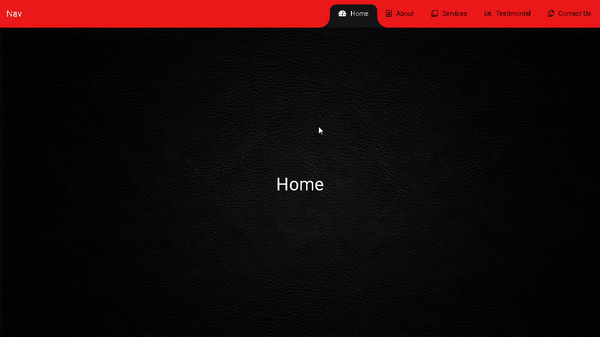

- [Repository](https://github.com/Nahuel61920/React-navbar)

 

 

## Day 03 - Animations 

- [Repository](https://github.com/Nahuel61920/Animations)

 

 

## Day 04 - Accordion 

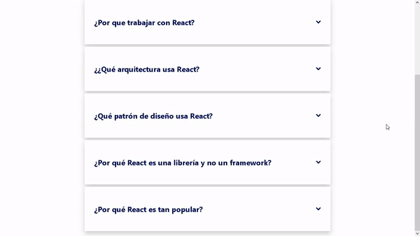

- [Repository](https://github.com/Nahuel61920/Accordion)

 

 

## Day 05 - Particles 

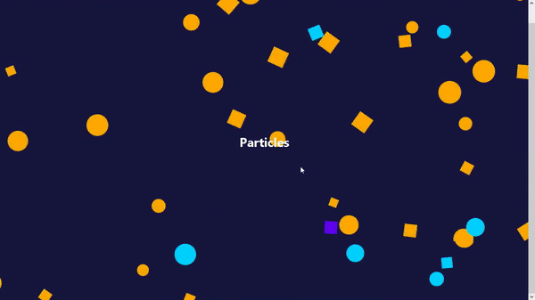

- [Repository](https://github.com/Nahuel61920/Particles)

 

 

## Day 06 - Typed 

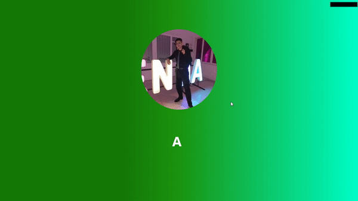

- [Repository](https://github.com/Nahuel61920/Typed)

 

 

## Day 07 - Spinners 

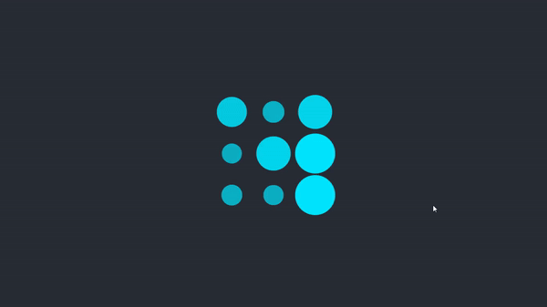

- [Repository](https://github.com/Nahuel61920/Spinners)

 

 

## Day 08 - Scroll To Top 

- [Repository](https://github.com/Nahuel61920/ScrollToTop)

 

 

## Day 09 - Dark Mode 

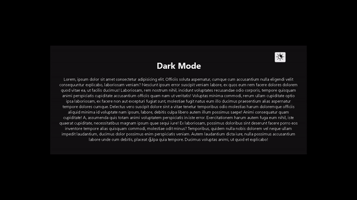

- [Repository](https://github.com/Nahuel61920/Dark-Mode-React)

 

 

## Day 10 - Modal 

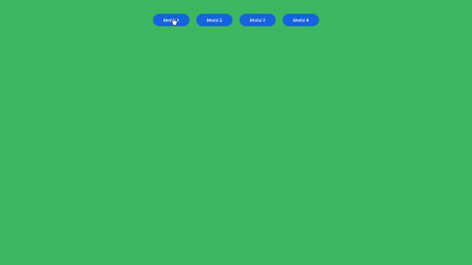

- [Repository](https://github.com/Nahuel61920/Modal-React)

 

 

## Day 11 - Digital Clock 

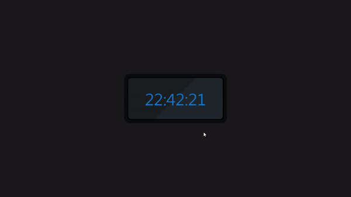

- [Repository](https://github.com/Nahuel61920/Digital-Clock)

 

 

## Day 12 - PDF Generator 

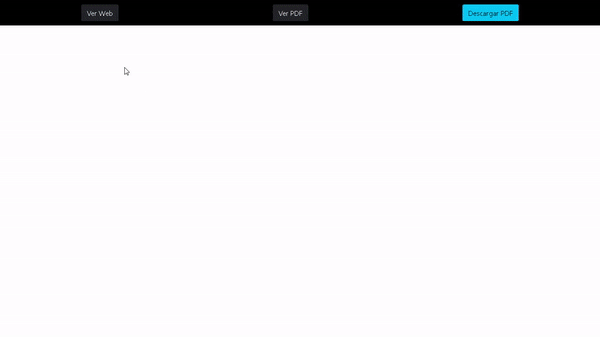

- [Repository](https://github.com/Nahuel61920/PDF-Generator)

 

 

## Day 13 - Memorama React 

- [Repository](https://github.com/Nahuel61920/Memorama-react)

 

 

## Day 14 - Lazy Loading 

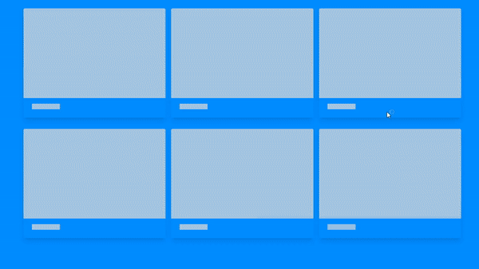

- [Repository](https://github.com/Nahuel61920/Lazy-Loading)

 

 

## Day 15 - Excel in React 

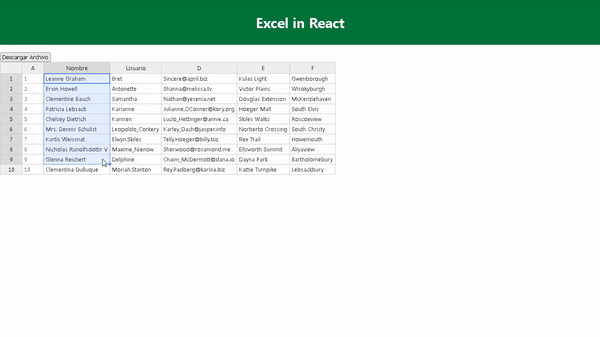

- [Repository](https://github.com/Nahuel61920/Excel-in-React)

 

## Day 16 - Color Generator 

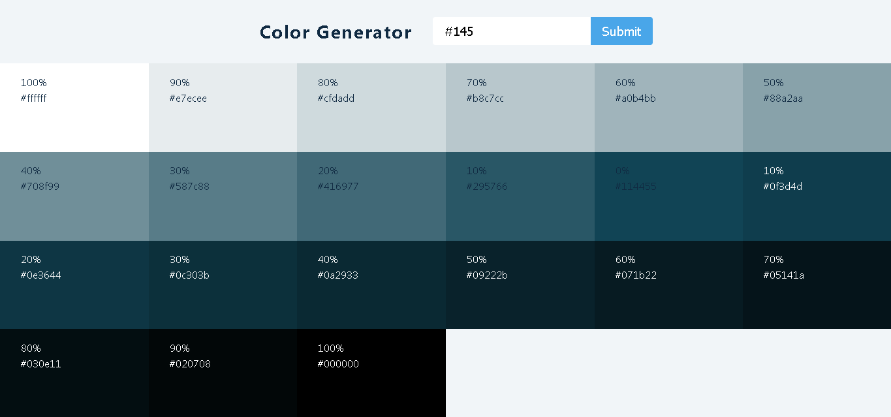

- [Repository](https://github.com/Nahuel61920/Color-Generator)

 

## Day 17 - Lorem ipsum generator <a name="id17"></a    >

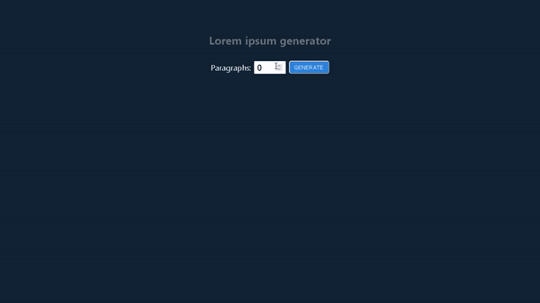

- [Repository](https://github.com/Nahuel61920/Lorem-ipsum-generator)

 

## Day 18 - Grocery list <a name="id18"></a    >

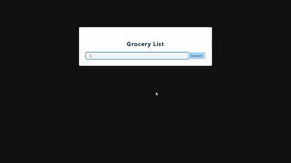

- [Repository](https://github.com/Nahuel61920/Grocery-list)

 

## Day 19 - BMI Calculator <a name="id19"></a    >

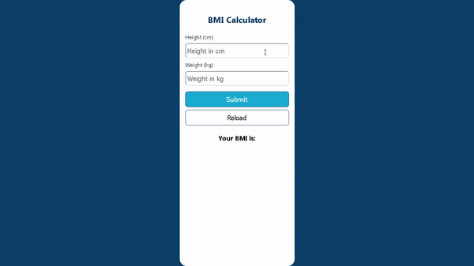

- [Repository](https://github.com/Nahuel61920/BMI-Calculator)

 

## Day 20 - QR Generator <a name="id20"></a    >

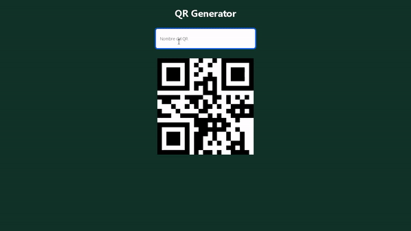

- [Repository](https://github.com/Nahuel61920/QR-Generator)

 

## Day 21 - Gifs App <a name="id21"></a    >

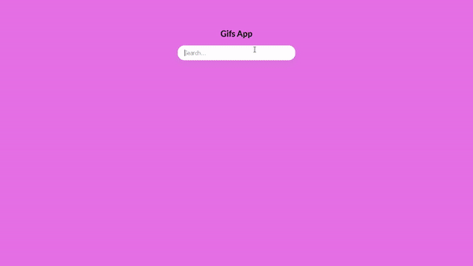

- [Repository](https://github.com/Nahuel61920/Gifs-App)

 

## Day 22 - Git Users <a name="id22"></a    >

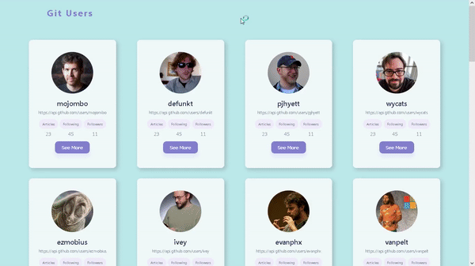

- [Repository](https://github.com/Nahuel61920/Git-Users)

 

## Day 23 - Step Form <a name="id23"></a    >

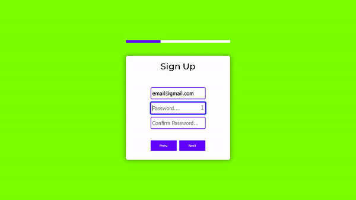

- [Repository](https://github.com/Nahuel61920/Step-Form)

 

## Day 24 - Graphics ChartJS <a name="id24"></a    >

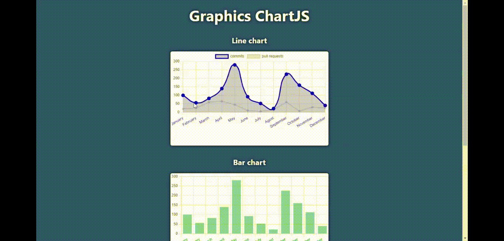

- [Repository](https://github.com/Nahuel61920/Graphics-ChartJS)

 
